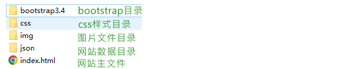

# 商城排序案例

### UI组件库

有结构、样式、功能的库，里面提供了很多开发中常用的组件，开发中直接把组件调去过来使用即可，无需从头开发（可能需要进行二次开发，因为组件的效果不一定是自己想要的）。

常用的组件库：

- bootstrap（经常配合jquery一起使用），支持响应式布局开发（栅格系统）
- vue:vue element / iview
- react:antd
- EasyUI / AmazeUI...

该案例使用bootstrap来实现，https://www.bootcss.com/ 为bootstrap的官网。bootstrap的文档地址https://v4.bootcss.com/docs/components/card/

### 文件结构

